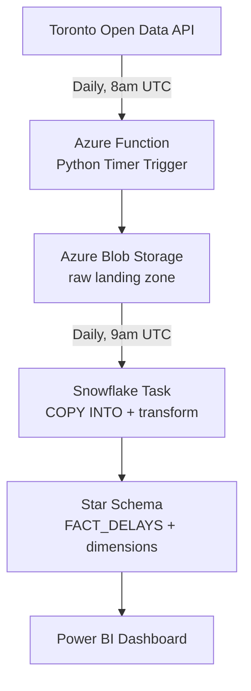

# TTC Transit Delay Analytics Pipeline

An end-to-end data pipeline that automatically pulls live TTC (Toronto Transit Commission) delay data every day, cleans and models it in a proper data warehouse, and powers an interactive Power BI dashboard — with zero manual steps required to keep it running.

## Why this project

Most portfolio projects use a static, downloaded-once dataset. This one doesn't: it runs on its own schedule, every day, pulling fresh data from the City of Toronto's live Open Data API. It was built to demonstrate real-world, end-to-end data engineering and analytics skills — extraction, cloud automation, data warehousing, and BI — rather than just SQL or dashboard skills in isolation.

## Architecture



## Tech stack

| Layer | Tool | Purpose |
|---|---|---|
| Source | Toronto Open Data (CKAN API) | Live subway/bus/streetcar delay records |
| Ingestion | Azure Functions (Python) | Serverless daily extraction, timer-triggered |
| Storage | Azure Blob Storage | Raw JSON landing zone, partitioned by pull date |
| Warehouse | Snowflake | Raw layer, staging views, star schema, scheduled Task automation |
| BI | Power BI | Interactive dashboard, Import mode |

## What the dashboard answers

- Which delay causes cost the network the most total time
- How subway, bus, and streetcar compare on incident frequency vs. average delay length
- Which stations experience the highest cumulative delay
- How delay volume trends month over month

## Key finding

Bus delays caused by being **"On Diversion"** account for the single largest share of total network delay minutes of any cause, across all three transit modes combined — a pattern that holds consistently across every month in the dataset.

## Repository structure

```
/extraction        Local Python scripts: API testing, full extraction, blob upload
/azure-function     Deployed Azure Function source (Python v2 programming model)
/sql                Snowflake setup: stage, raw tables, staging views, star schema, automation
README.md
```

## How the pipeline runs

1. An Azure Function (`daily_ttc_pull`) fires daily at 8:00 AM UTC, pulls the full current dataset for all three transit modes from Toronto's CKAN API, and uploads it to Blob Storage as JSON, partitioned by date.
2. A Snowflake Task (`DAILY_TTC_REFRESH`) fires daily at 9:00 AM UTC, reloading the raw tables from that day's Blob Storage files and rebuilding the cleaned star schema (`FACT_DELAYS`, `DIM_DELAY_CODE`, `DIM_DATE`).
3. Power BI connects directly to the Snowflake star schema to power the dashboard.

## Data quality handling

- Normalized an inconsistent date format across the three source datasets (some included a time component, some did not).
- Fixed a text-encoding artifact in delay-code descriptions.
- Used a full daily reload rather than incremental extraction, since the source dataset does not guarantee stable row IDs across refreshes.

## Author

Built by Drashtant Anupamkumar as a portfolio project targeting Data Analyst / AI Data Analyst roles in the Greater Toronto Area.
